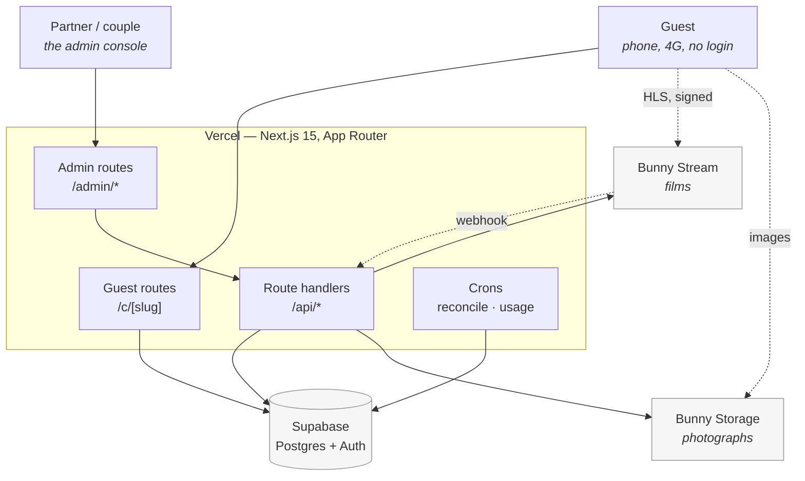
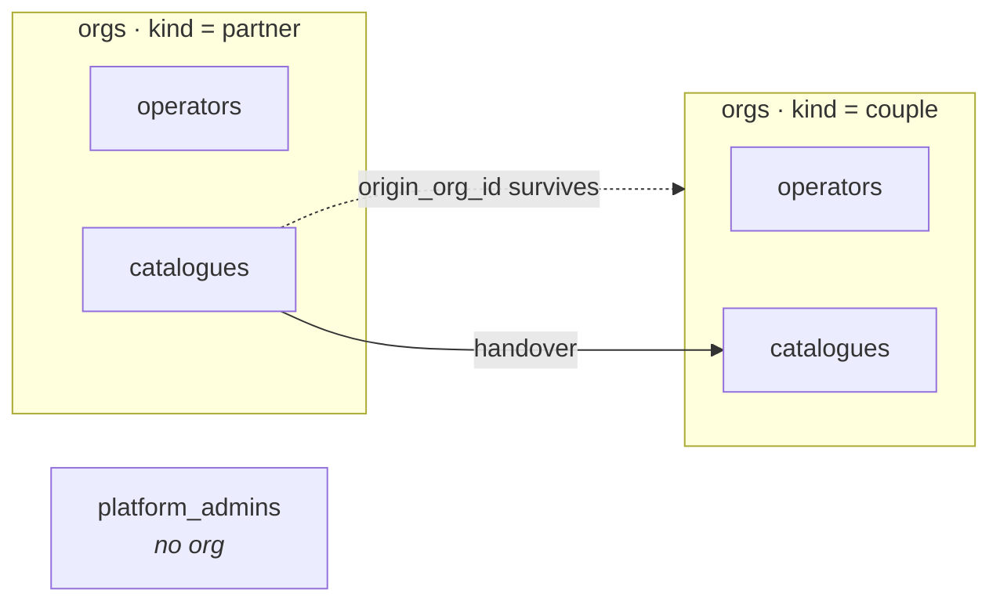
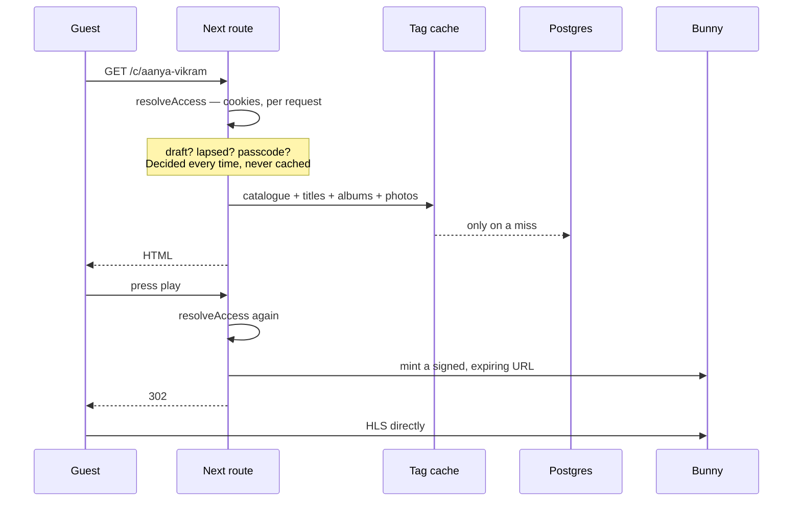
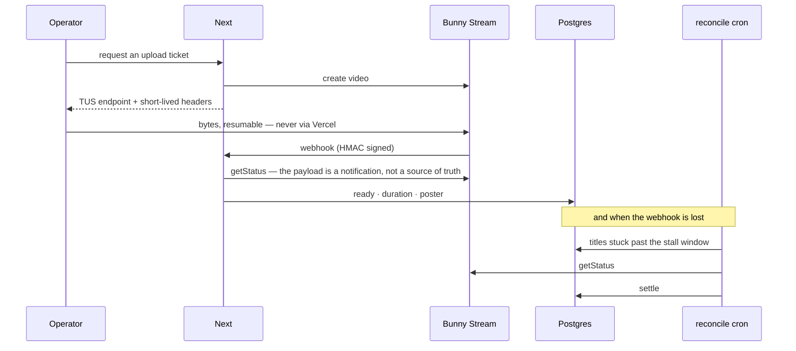
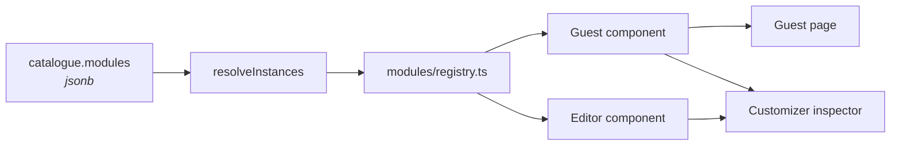

# Architecture

How this system is put together, and why. The **specification** — what the product is meant to
be — lives in [`docs/spec/`](./spec/). This document describes what was actually built.

Diagrams are Mermaid, so they render on GitHub without a build step.

---

## 1. What talks to what



**A guest's browser never speaks to Postgres.** Every read and write goes through a route
handler holding the service-role key, server-side. The anon role has no policies at all, because
every grant it had was a capability no code exercised — and the key is `NEXT_PUBLIC_`, printed
into every page (doc 15 §0).

Film bytes are the exception in the other direction: they go **browser → Bunny** over TUS,
never through Vercel. Photographs do proxy through the app, deliberately — the storage password
can delete every catalogue's images, so it must not reach a browser.

---

## 2. Who can see what

Three kinds of account, **one isolation mechanism**.



Every query is scoped by `org_id` taken **from the session, never from the request**, in
`lib/admin/session.ts`. A route that does not call `requireOperator` or `requireOwnedCatalogue`
is visibly unscoped, which is what makes the rule auditable.

Two consequences worth stating plainly:

- **A couple gets its own org** on handover, rather than an `owner_id` column. A column would
  make every query ask "my org, *or* am I the owner?" — in RLS and in session handling, forever.
  Cross-tenant leaks live in that branch.
- **A platform admin is not in an org.** If "admin" were a membership, every scoped query would
  have to ask whether this member is special. Platform-wide views get written one at a time
  instead of falling out of a predicate nobody re-read.

Another org's catalogue answers **404, not 403** — it is never confirmed to exist.

---

## 3. A guest opening a link



**Cached on content, never on permission.** The route reads cookies for locale, profile and
passcode grant, so it cannot be statically rendered — whether a guest may see this catalogue
*depends on their cookies*. The reads are cached instead, tagged per catalogue, and every write
an operator can see the result of drops that tag.

Playback URLs are signed against the asset's **directory** and expire within the hour, so a
copied `.m3u8` dies (doc 01 US-5). The database never stores a signed URL — it stores a stable
app route that re-signs per request.

---

## 4. A film arriving



Webhooks get lost, so the cron is not a nicety. It examines **`uploading` as well as
`processing`**: a title is created `uploading` and it is the webhook that moves it on, so the
exact failure the job exists for used to leave rows in the one state it could not see.

---

## 5. The seams

Four places where an external service could be swapped, each with a fake for the test suite.
This is why `pnpm test` and the Playwright suite run with **no Supabase project, no Bunny
account and no network**.

| Seam | Drivers | Chosen by |
|---|---|---|
| `lib/db/repository.ts` | `memory` · `file` · `supabase` | `DATA_DRIVER` |
| `lib/video/provider.ts` | `fake` · `bunny` | `VIDEO_DRIVER` |
| `lib/photos/provider.ts` | `fake` · `bunny` | `PHOTO_DRIVER` |
| `lib/admin/auth-provider.ts` | `local` · `supabase` | `AUTH_DRIVER` |

The auth seam answers only **"who is this"**. Which org they belong to is resolved afterwards
from the `operators` row, so swapping the authenticator can never widen what somebody reaches.

Addressing is configuration too: `TENANCY_MODE` switches between `<slug>.example.com` and
`example.com/c/<slug>`, and `cataloguePath` is the single place that knows which.

---

## 6. Modules — the customizer's moat

A catalogue's page is an ordered list of module instances, each validated by its own schema.



`modules/registry.ts` is the **only** place a module type is named. Nothing else may switch on
one — enforced by `tests/unit/registry.test.ts`, not by convention.

The customizer's preview mounts the **real guest components**, not a mock, so an operator cannot
publish something they never saw. Selection is a delegated click handler against the
`data-module-id` tags the renderer already emits, and the outline is scoped CSS — nothing in the
guest tree learns what editing is.

---

## 7. Handing a wedding over

```mermaid
sequenceDiagram
    participant P as Partner
    participant N as Next
    participant Cp as Couple

    P->>N: hand over → to this address
    N->>N: 32 random bytes; store only the SHA-256
    N-->>P: a link to forward
    P-->>Cp: WhatsApp
    Cp->>N: opens the link
    N-->>Cp: what is being handed over, and by whom
    Cp->>N: sets a password
    N->>N: couple org + operator
    N->>N: snapshot "presented by" while the partner still owns the row
    N->>N: transferCatalogue(from → to)
    Note over P: gone from their list; 404 by id
```

The token is a bearer credential travelling through a forwarded message: single use, fourteen
days, stored only as a hash. Missing, expired and already-claimed answer **identically** — a
link that says which one tells whoever found it something about a wedding they should not know.

Moving between orgs is its own repository method. `updateCatalogue` deliberately omits `orgId`,
so no ordinary patch can change ownership.

---

## 8. Where the risk actually is

Unchanged from `CLAUDE.md`, and worth repeating because it is where to look first:

- **`lib/catalogue-access.ts`** — the only place a guest request is authorised.
- **`lib/admin/session.ts`** — the only place `org_id` enters a query.
- **`modules/registry.ts`** — a `switch` on module type anywhere else is the abstraction leaking.
- **`components/admin/UploadManager.tsx`** — resumable multi-gigabyte upload; do not simplify the
  offset handling.

## 9. Reading order

| You want | Read |
|---|---|
| What the product is | `docs/spec/01-product-spec.md` |
| What is built and why | `docs/PROGRESS.md` |
| What is next | `docs/NEXT.md` |
| How to deploy it | `docs/DEPLOYMENT.md` |
| Partners, scale, money | `docs/spec/15-partners-and-scale.md` |
| The rules that keep it coherent | `CLAUDE.md` |
